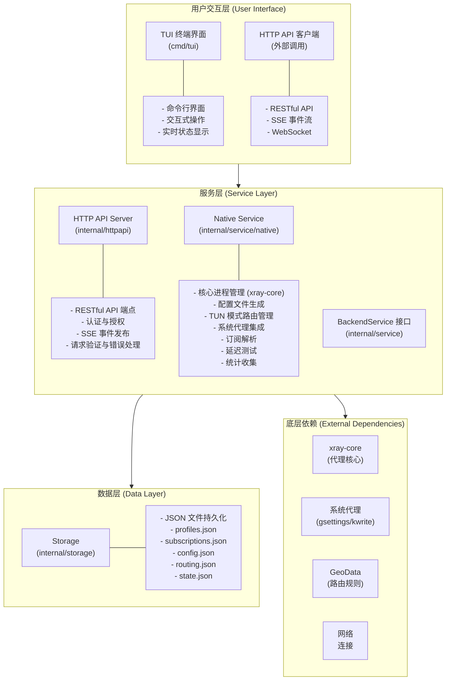
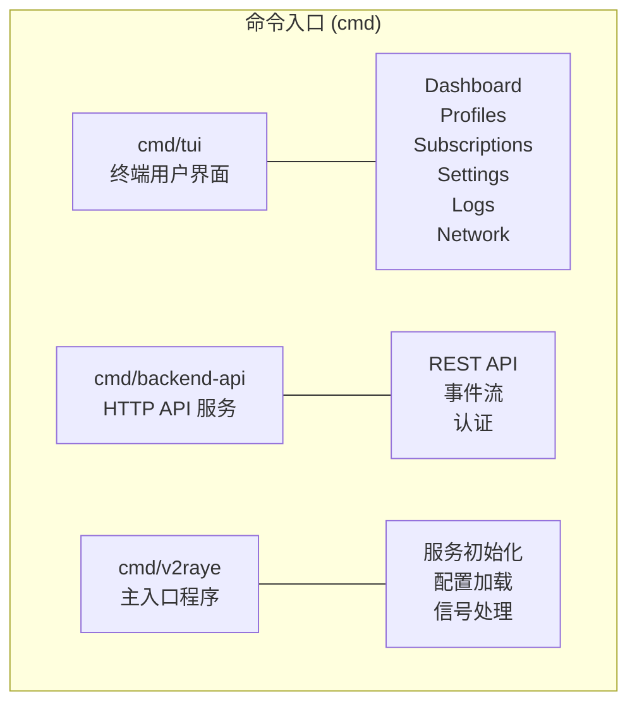
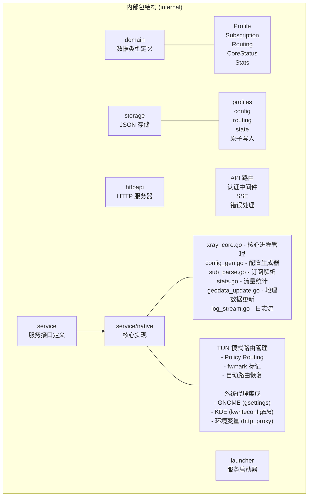
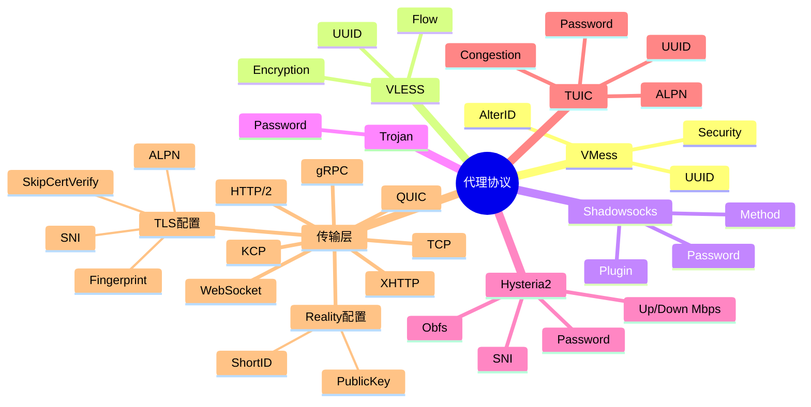
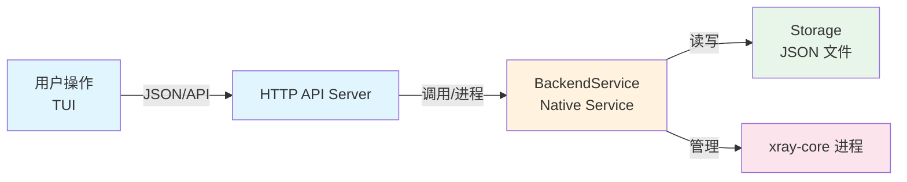
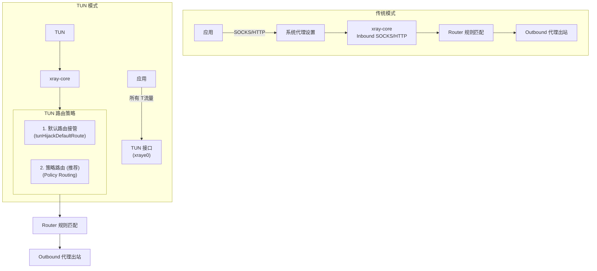
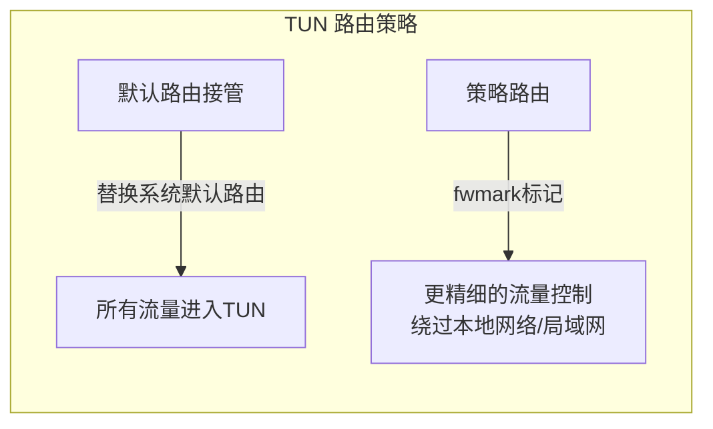

# v2rayE 系统架构图

## 1. 整体架构概览



## 2. 核心模块架构

### 2.1 命令行入口 (cmd)



### 2.2 内部包结构 (internal)



## 3. 代理协议支持



## 4. 数据流方向



## 5. 事件流架构

```mermaid
flowchart TB
    subgraph EventBus["事件总线"]
        Service["Backend Service"]
        Server["HTTP API Server"]
        
        Service <-->|publishEvent()| Server
    end
    
    subgraph SSE["SSE 事件类型"]
        CoreEvents["core.started<br/>core.stopped<br/>core.restarted<br/>core.start_failed<br/>core.error_cleared"]
        ProfileEvents["profile.updated<br/>profile.selected"]
        SubEvents["subscription.updated"]
        RoutingEvents["routing.updated<br/>routing.tested<br/>routing.tun_repaired"]
        ConfigEvents["config.updated<br/>proxy.changed<br/>app.exit_cleanup"]
        LogEvents["log (实时日志)"]
    end
    
    Server --> CoreEvents
    Server --> ProfileEvents
    Server --> SubEvents
    Server --> RoutingEvents
    Server --> ConfigEvents
    Server --> LogEvents
```

## 6. TUN 模式架构



### TUN 路由策略详解



### 系统代理集成

```mermaid
flowchart LR
    subgraph Desktop["桌面环境"]
        GNOME["GNOME<br/>(gsettings)"]
        KDE["KDE<br/>(kwriteconfig5/6)"]
        Env["环境变量<br/>(http_proxy)"]
    end
    
    GNOME --> Proxy["系统代理设置"]
    KDE --> Proxy
    Env --> Proxy