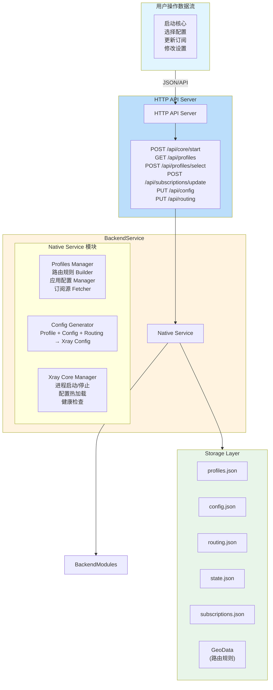
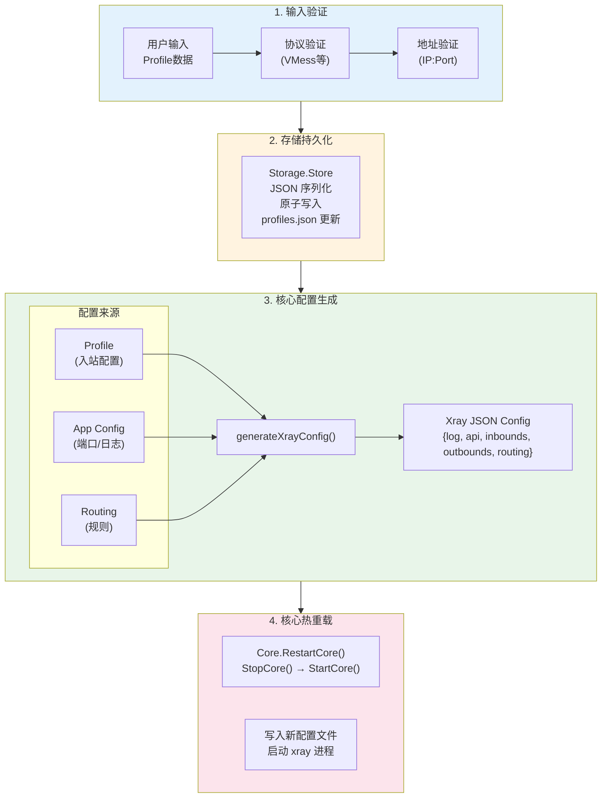
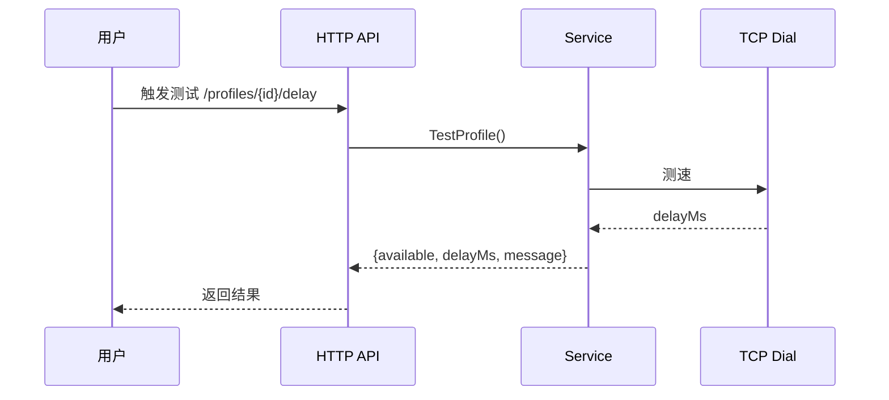
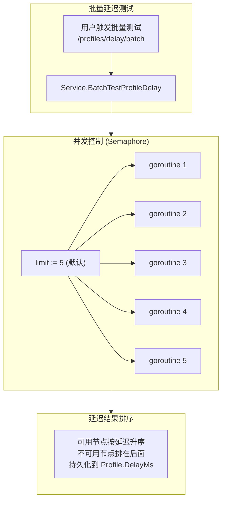
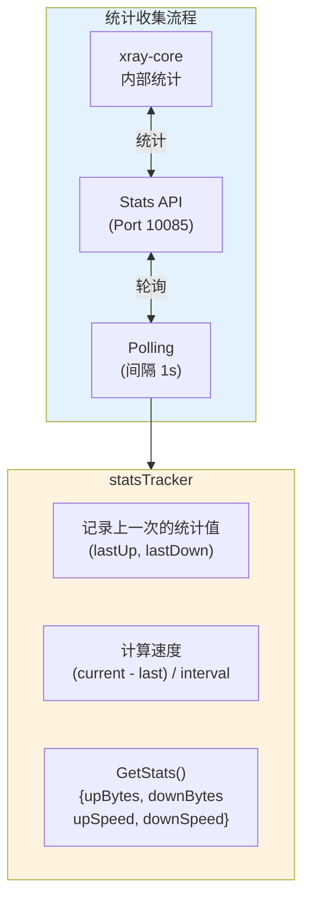
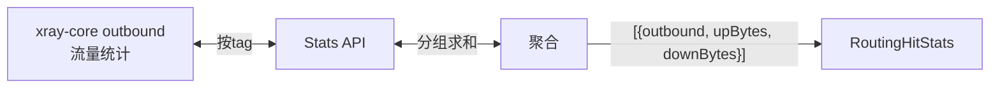
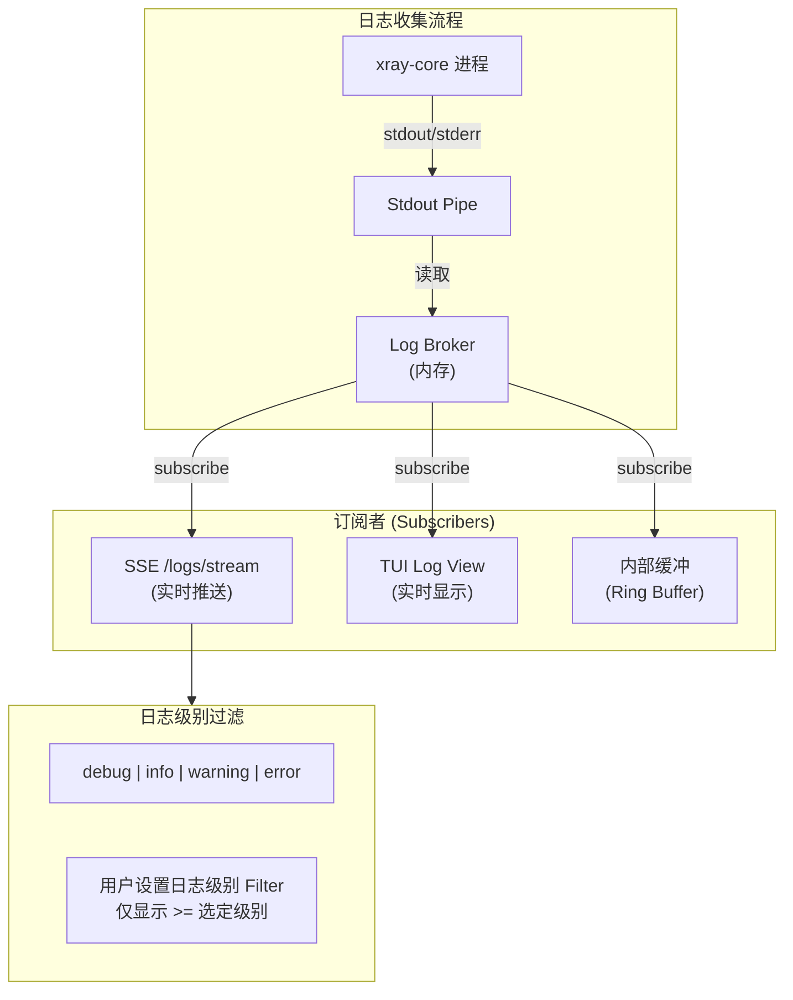

# v2rayE 数据流架构图

## 1. 核心数据流总览



## 2. 代理配置数据流



## 3. 订阅数据流

```mermaid
flowchart TB
    subgraph Triggers["更新触发"]
        Manual["用户触发<br/>(手动更新)"]
        Timer["定时任务<br/>(AutoUpdate)"]
        Boot["启动时恢复<br/>(autoRun)"]
        
        Manual --> UpdateSub
        Timer --> UpdateSub
        Boot --> UpdateSub
    end
    
    subgraph Update["UpdateSubscriptionByID()"]
        Fetch["1. Fetch URL<br/>HTTP GET with User-Agent<br/>Base64 解码<br/>解析 URI 链接"]
        Filter["2. Filter (可选)<br/>按 filter 正则过滤节点<br/>按 convertTarget 转换协议"]
        Merge["3. 合并 Profiles<br/>删除旧订阅的 profiles<br/>添加新的 profiles<br/>分配新的 ProfileID"]
        Persist["4. 持久化存储<br/>Store.SaveProfiles()"]
        Event["5. 事件通知<br/>Server.publishEvent()"]
    end
    
    UpdateSub[UpdateSubscriptionByID()] --> Fetch --> Filter --> Merge --> Persist --> Event
    
    Event -.->|"→ SSE 推送"| Frontend["前端更新"]
```

## 4. 延迟测试数据流

### 单节点延迟测试



### 批量延迟测试



## 5. 统计数据流



### 路由命中统计



## 6. 日志数据流



```mermaid
flowchart LR
    subgraph LogLevels["日志级别"]
        Debug["debug"]
        Info["info"]
        Warning["warning"]
        Error["error"]
    end
    
    UserFilter -->|"过滤"| Visible["可见日志"]