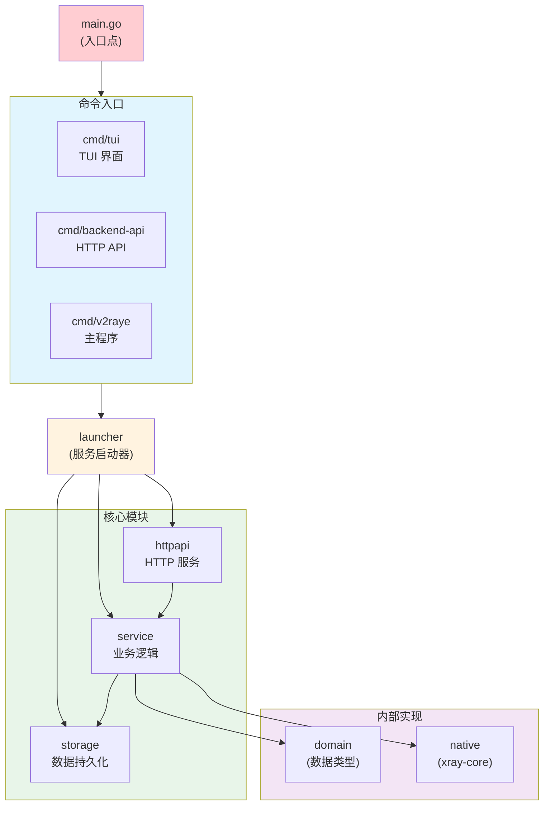
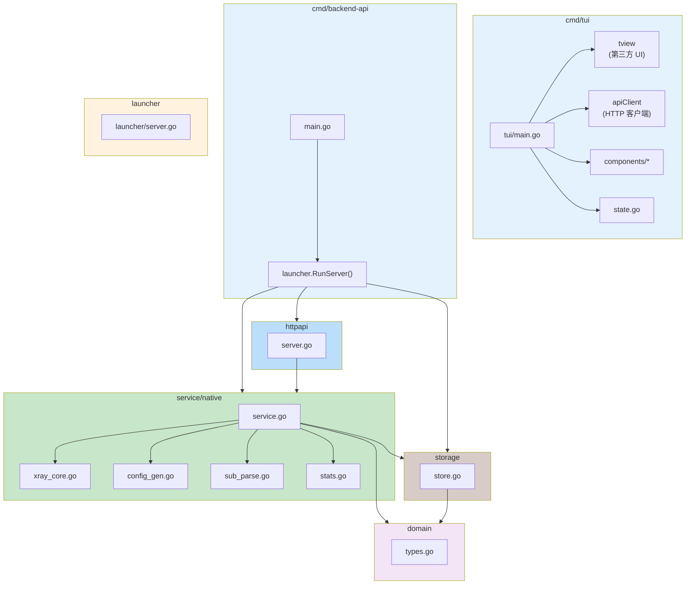
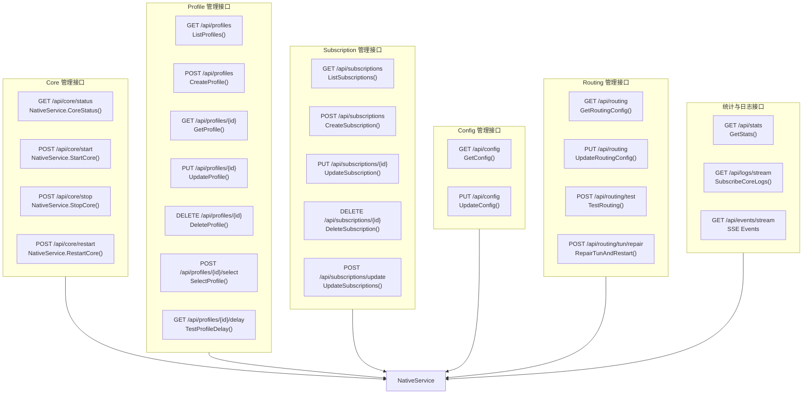
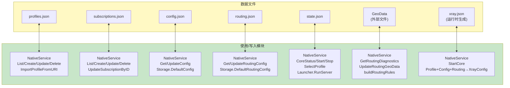

# v2rayE 模块依赖关系图

## 1. 整体模块依赖关系



## 2. 详细模块依赖



## 3. API 端点依赖关系



## 4. 数据文件依赖关系



## 5. 第三方依赖

```mermaid
flowchart LR
    subgraph Direct["直接依赖 (go.mod)"]
        TView["github.com/rivo/tview<br/>TUI 终端界面框架"]
        TCell["github.com/gdamore/tcell/v2<br/>TUI 底层终端渲染"]
        Runewidth["github.com/mattn/go-runewidth<br/>文本宽度计算"]
        Uniseg["github.com/rivo/uniseg<br/>Unicode 字符宽度"]
    end
    
    subgraph Runtime["系统依赖 (运行时)"]
        Xray["xray / xray-core<br/>代理核心进程"]
        IP["ip (iproute2)<br/>网络接口/路由管理"]
        GSettings["gsettings (Gnome)<br/>GNOME 桌面代理设置"]
        KWrite["kwriteconfig5/6 (KDE)<br/>KDE 桌面代理设置"]
        DBus["dbus-send (D-Bus)<br/>KDE 桌面通知"]
        Loginctl["loginctl (systemd)<br/>查询登录用户"]
    end
    
    subgraph Std["标准库依赖"]
        NetHTTP["net/http<br/>HTTP 客户端/服务器"]
        JSON["encoding/json<br/>JSON 编解码"]
        Exec["os/exec<br/>进程管理"]
        User["os/user<br/>用户信息查询"]
        Net["net<br/>网络连接"]
        Time["time<br/>定时器/时间"]
        Sync["sync<br/>并发原语"]
        Context["context<br/>上下文控制"]
        Log["log<br/>日志"]
    end
    
    style Direct fill:#e1f5fe
    style Runtime fill:#ffccbc
    style Std fill:#d1c4e9