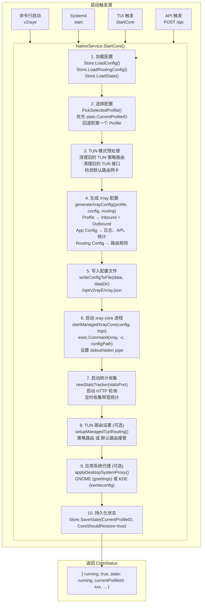
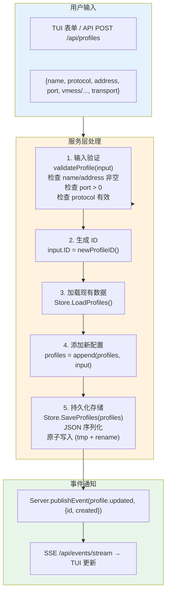
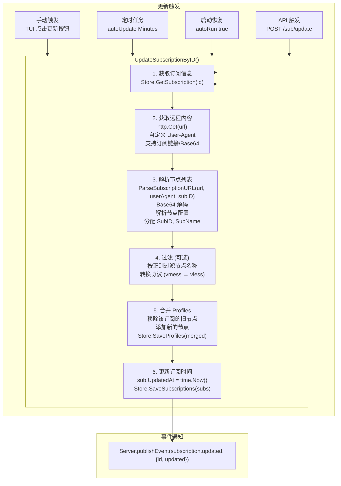
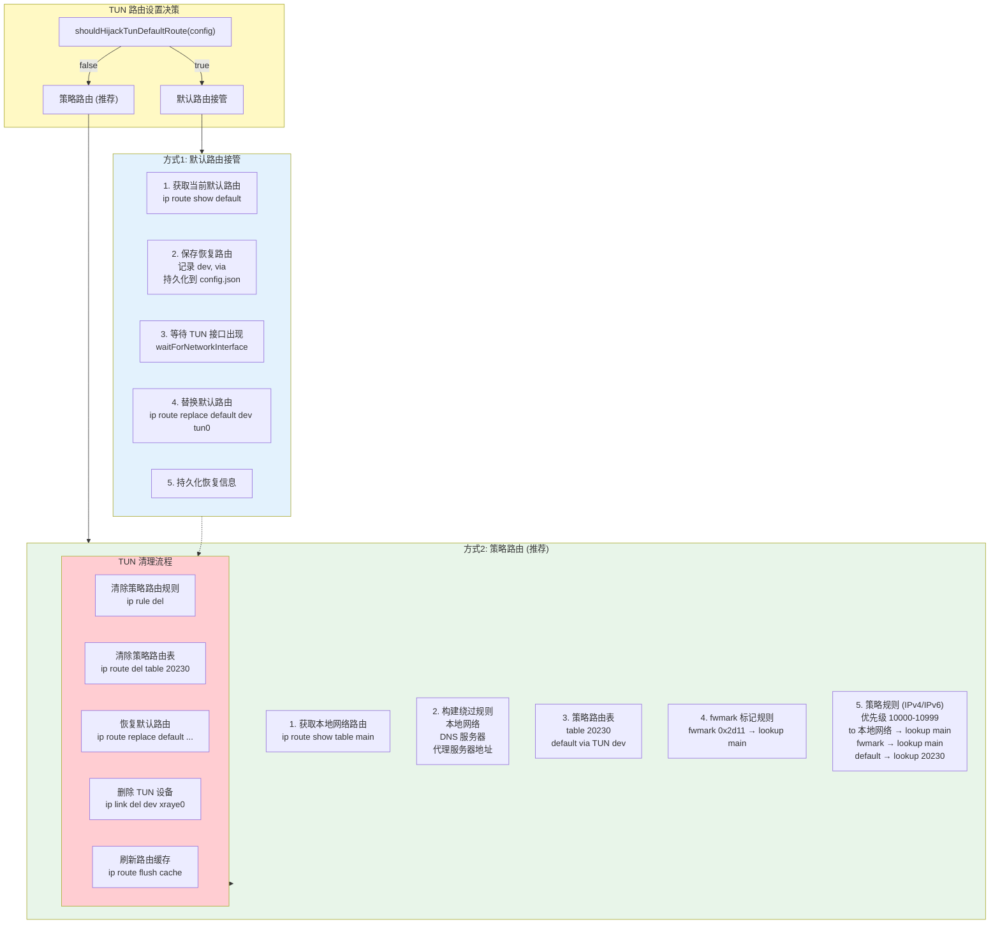
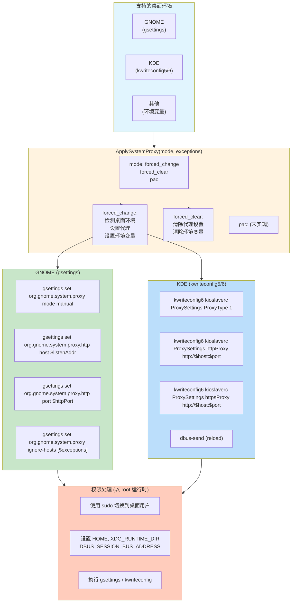
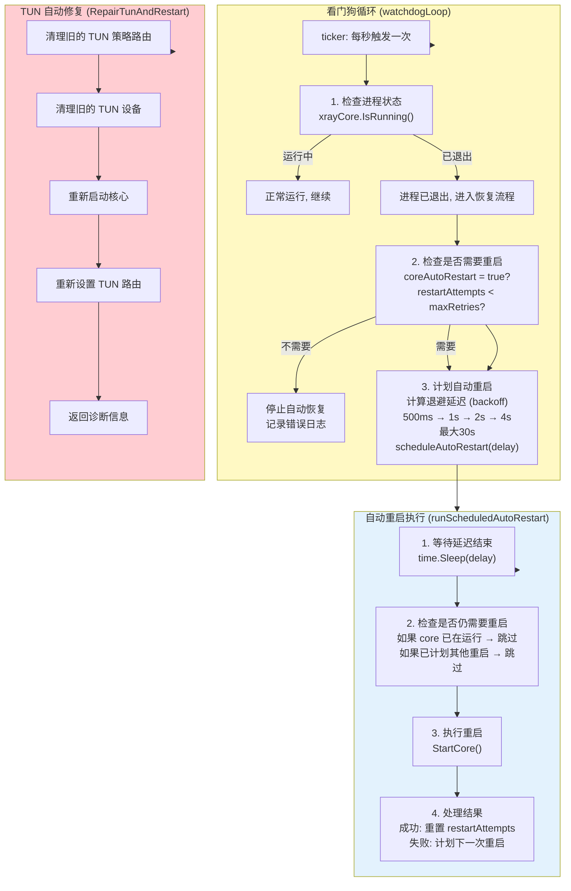

# v2rayE 功能流程图

## 1. 核心启动流程



## 2. 代理配置创建流程



## 3. 订阅更新流程



## 4. TUN 模式路由设置流程



## 5. 系统代理集成流程



## 6. 健康检查与自动恢复流程



### 退避策略详解

```mermaid
flowchart LR
    subgraph Backoff["指数退避 (Exponential Backoff)"]
        B1["500ms"] --> B2["1s"] --> B3["2s"] --> B4["4s"] --> B5["8s"] --> B6["16s"] --> B7["30s (max)"]
    end
    
    Max["最大重试次数: 5"]
    Reset["成功后重置计数器"]