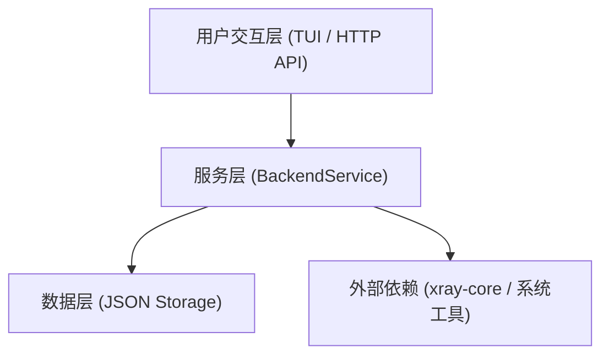

# v2rayE 设计文档

本文档详细描述了 v2rayE 项目的架构设计、功能流程和模块依赖关系。

## 文档列表

### 1. [系统架构图](01-system-architecture.md)

包含以下内容：
- **整体架构概览** - 四层架构：用户交互层、服务层、数据层、外部依赖层
- **核心模块架构** - cmd、internal 包结构
- **代理协议支持** - VMess、VLESS、Shadowsocks、Trojan、Hysteria2、TUIC
- **数据流方向** - 用户操作 → HTTP API → Service → xray-core
- **事件流架构** - SSE 事件发布订阅机制
- **TUN 模式架构** - 传统代理 vs TUN 模式对比，策略路由详解

### 2. [数据流架构图](02-dataflow-architecture.md)

包含以下内容：
- **核心数据流总览** - 用户操作到存储的完整数据流
- **代理配置数据流** - Profile 创建/更新 → 存储 → 配置生成 → 核心热重载
- **订阅数据流** - 订阅更新流程：获取 → 解析 → 过滤 → 合并 → 持久化
- **延迟测试数据流** - 单节点测试 + 批量并发测试（含信号量控制）
- **统计数据流** - xray-core Stats API → 轮询 → 速度计算 → 前端展示
- **日志数据流** - 进程 stdout → Log Broker → SSE 推送 → TUI 显示

### 3. [模块依赖关系图](03-module-dependency.md)

包含以下内容：
- **整体模块依赖** - main.go → cmd/* → launcher → httpapi/service/storage
- **详细模块依赖** - 各源文件的 import 关系
- **API 端点映射** - HTTP 端点 → Service 方法的完整对应表
- **数据文件关系** - JSON 文件 ↔ 模块的读写关系
- **第三方依赖** - 直接依赖、系统依赖、标准库依赖

### 4. [功能流程图](04-feature-flow.md)

包含以下内容：
- **核心启动流程** - 10 步详细启动流程：配置加载 → 选择 Profile → TUN 预处理 → 配置生成 → 启动进程 → 统计收集 → 路由设置 → 代理应用 → 状态持久化
- **代理配置创建流程** - 输入验证 → ID 生成 → 存储持久化 → 事件通知
- **订阅更新流程** - 触发方式 → 获取远程 → 解析节点 → 过滤合并 → 存储
- **TUN 模式路由设置流程** - 默认路由接管 vs 策略路由两种方式
- **系统代理集成流程** - GNOME(gsettings) / KDE(kwriteconfig) / 环境变量
- **健康检查与自动恢复流程** - 看门狗循环 → 指数退避 → 自动重启 → TUN 修复

## 核心概念

### 分层架构

### 核心模块

| 模块 | 职责 |
|------|------|
| `cmd/tui` | 终端用户界面 |
| `cmd/backend-api` | HTTP API 服务入口 |
| `launcher` | 服务启动与初始化 |
| `httpapi` | RESTful API + SSE 事件 |
| `service/native` | 核心业务逻辑 |
| `storage` | JSON 文件持久化 |
| `domain` | 数据类型定义 |

### 数据文件

| 文件 | 用途 |
|------|------|
| `profiles.json` | 代理服务器配置列表 |
| `subscriptions.json` | 订阅源配置 |
| `config.json` | 应用配置 |
| `routing.json` | 路由规则 |
| `state.json` | 运行时状态 |
| `xray.json` | 运行时生成的 xray 配置 |

### 支持的代理协议

- **VMess** - 轻量代理协议
- **VLESS** - 无状态加密协议
- **Shadowsocks** - 沙盒代理
- **Trojan** - 基于 TLS 的代理
- **Hysteria2** - 高性能代理协议
- **TUIC** - QUIC-based 代理协议

### 传输层

- TCP
- WebSocket
- gRPC
- HTTP/2
- KCP
- QUIC
- XHTTP

### TUN 模式

- **默认路由接管** - 替换系统默认路由
- **策略路由 (推荐)** - 使用 fwmark 和策略路由表，更精细的流量控制

### 系统代理集成

- **GNOME** - 通过 gsettings
- **KDE** - 通过 kwriteconfig5/6
- **环境变量** - http_proxy / https_proxy

## 关键特性

1. **热重载** - 修改配置后无需重启核心
2. **自动恢复** - 看门狗机制自动重启崩溃的核心
3. **TUN 修复** - 一键修复 TUN 路由问题
4. **订阅支持** - 自动获取/更新订阅节点
5. **延迟测试** - 单节点/批量延迟测试
6. **流量统计** - 实时带宽和路由命中统计
7. **日志流** - 实时日志推送

## 文档版本

- 版本: 1.0
- 创建日期: 2026-03-10
- 项目: v2rayE Backend (Go)