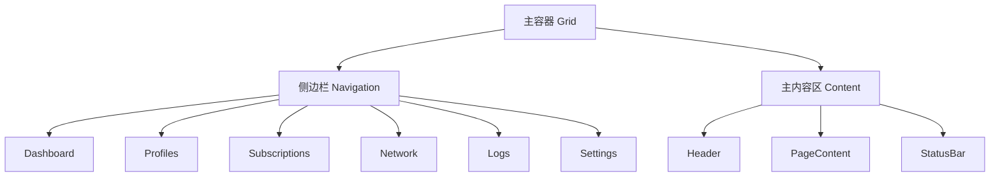
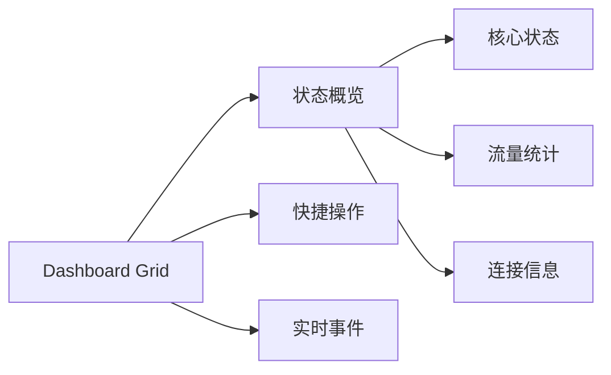

# TUI 重构方案 - 完整实施计划

## 概述

基于 tview demos 最佳实践，对现有 TUI 进行全面重构，采用 Grid 布局 + Form 组件 + 侧边栏导航，打造更专业的终端用户界面。

---

## 一、布局重构

### 1.1 新布局结构



### 1.2 布局对比

| 特性 | 现有方案 | 重构方案 |
|------|----------|----------|
| 导航方式 | 顶部 TabBar | 左侧边栏 |
| 布局容器 | Flex | Grid + Flex 混合 |
| 响应式 | 窄屏自动堆叠 | 智能 Grid 布局 |
| 代码组织 | 分散在 helpers | 组件化封装 |

---

## 二、导航重构

### 2.1 侧边栏导航 (参考 presentation demo)

```go
// 新增组件: 侧边栏导航
type Sidebar struct {
    items    []NavItem
    selected int
}

type NavItem struct {
    Key      string
    Label    string
    Shortcut rune
    Icon     string
}
```

**特性：**
- 固定宽度侧边栏 (25-30 字符)
- 高亮当前选中项
- 显示快捷键提示
- 支持上下键导航

### 2.2 顶部快捷栏

保留顶部快捷操作栏，显示：
- 核心状态指示 (运行中/已停止)
- CPU/内存占用
- 当前配置文件
- 连接数

---

## 三、页面重构

### 3.1 Dashboard 页面

**现有问题：**
- 布局简单，信息分散
- 缺少数据可视化

**重构目标：**


**实现方案：**
```go
// 使用 Grid 实现专业仪表盘
grid := tview.NewGrid().
    SetRows(3, 0, 3).
    SetColumns(30, 0, 30)

// 状态卡片
statusCard := NewCard("核心状态", statusView)
trafficCard := NewCard("流量统计", trafficView)
eventCard := NewCard("最近事件", eventsView)
```

### 3.2 Profiles 页面 (使用 Form 组件)

**现有问题：**
- 使用大量 InputField 堆叠
- 表单验证体验差
- 字段分组不清晰

**重构方案 - 参考 form demo:**
```go
// 使用 Form 组件重构配置文件编辑器
form := tview.NewForm().
    AddDropDown("协议类型", []string{"vmess", "vless", "trojan", "shadowsocks"}, 0, onProtocolChanged).
    AddInputField("服务器地址", "", 40, nil, onAddressChanged).
    AddInputField("端口", "", 10, tview.InputFieldInteger, onPortChanged).
    AddPasswordField("密码", "", 30, '*', nil).
    AddCheckbox("启用 TLS", false, nil).
    AddButton("保存", onSave).
    AddButton("取消", onCancel)
```

**优势：**
- 自动标签对齐
- 内置验证支持
- 按钮组自动排列
- Tab 导航自动处理

### 3.3 Settings 页面

**现有问题：**
- 按钮过多，排列混乱
- 焦点组复杂难维护

**重构方案 - 使用 Form + 分组:**
```go
// 分组表单
generalForm := tview.NewForm().
    AddDropDown("语言", []string{"English", "中文"}, 0, nil).
    AddDropDown("核心引擎", []string{"xray-core"}, 0, nil).
    AddButton("保存", nil)

proxyForm := tview.NewForm().
    AddDropDown("代理模式", []string{"系统代理", "TUN模式", "PAC"}, 0, nil).
    AddInputField("SOCKS 端口", "", 10, tview.InputFieldInteger, nil).
    AddInputField("HTTP 端口", "", 10, tview.InputFieldInteger, nil)

tunForm := tview.NewForm().
    AddDropDown("TUN 模式", []string{"off", "system", "mixed", "gvisor"}, 0, nil).
    AddInputField("接口名称", "", 20, nil, nil).
    AddInputField("MTU", "", 10, tview.InputFieldInteger, nil)
```

---

## 四、组件增强

### 4.1 新增组件

| 组件 | 说明 | 用途 |
|------|------|------|
| Card | 带标题和边框的卡片容器 | 页面区块包装 |
| Sidebar | 侧边栏导航 | 主导航 |
| StatusBar | 底部状态栏 | 显示状态信息 |
| FormGroup | 分组表单 | Settings 页面 |
| Modal | 模态对话框 | 确认操作 |
| Toast | 轻量通知 | 操作反馈 |

### 4.2 组件示例

```go
// Card 组件
type Card struct {
    *tview.Box
    title   string
    content tview.Primitive
}

func NewCard(title string, content tview.Primitive) *Card {
    box := tview.NewBox()
    box.SetBorder(true)
    box.SetTitle(" " + title + " ")
    return &Card{Box: box, title: title, content: content}
}
```

---

## 五、视觉优化

### 5.1 配色方案

```go
// 主题色定义
const (
    ColorPrimary       = tcell.ColorTeal      // 主色调
    ColorSecondary     = tcell.ColorDarkBlue  // 次要色
    ColorAccent        = tcell.ColorYellow    // 强调色
    ColorSuccess       = tcell.ColorGreen    // 成功
    ColorError         = tcell.ColorRed      // 错误
    ColorWarning       = tcell.ColorOrange   // 警告
    ColorBackground    = tcell.ColorBlack    // 背景
    ColorSurface       = tcell.ColorDarkGray // 表面
    ColorText          = tcell.ColorWhite    // 文本
    ColorTextMuted     = tcell.ColorDarkGray // 次要文本
)
```

### 5.2 样式规范

| 元素 | 样式 |
|------|------|
| 标题 | 粗体 + 主色调 |
| 按钮 Normal | 深蓝色背景 + 白色文字 |
| 按钮 Active | 绿色背景 + 黑色文字 |
| 输入框 | 青色文字 + 深灰背景 |
| 边框 | 1px 实线 + 主题色 |

---

## 六、实施步骤

### 阶段 1：基础设施 (预计 2-3 小时)
- [x] 创建 `components/` 目录
- [x] 实现 Sidebar 导航组件
- [x] 实现 Card 组件
- [x] 实现主题颜色管理
- [x] 在 helpers.go 中添加 Grid 布局辅助函数
- [x] 在 helpers.go 中添加 Form 辅助函数

### 阶段 2：布局重构 (预计 3-4 小时)
- [x] 在 tuiApp 中添加 sidebar 字段
- [ ] 重构 `layout.go` 使用 Grid
- [ ] 迁移顶部 TabBar 到侧边栏
- [ ] 实现响应式布局切换

### 阶段 3：页面重构 (预计 6-8 小时)
- [ ] Dashboard 页面 Grid 化
- [ ] Profiles 页面 Form 化
- [ ] Settings 页面分组化
- [ ] 其他页面优化

### 阶段 4：交互优化 (预计 2-3 小时)
- [ ] 优化焦点管理
- [ ] 添加键盘快捷键支持
- [ ] 完善状态反馈

---

## 七、文件变更清单

### 新增文件
```
backend-go/cmd/tui/components/
├── sidebar.go      # 侧边栏导航组件
├── card.go         # 卡片组件
├── theme.go        # 主题管理
└── form.go         # 表单辅助组件
```

### 修改文件
```
backend-go/cmd/tui/
├── layout.go       # 重构为 Grid 布局
├── app.go          # 集成侧边栏
├── helpers.go      # 新增组件辅助函数
├── pages_dashboard.go
├── pages_profiles.go
├── pages_settings.go
└── 其他页面文件
```

---

## 八、注意事项

1. **向后兼容**: 保持现有功能不变
2. **渐进式迁移**: 逐页面重构，避免大规模重写
3. **测试验证**: 每重构一个页面，确保功能正常
4. **代码复用**: 提取公共组件，减少重复代码

---

## 九、预期效果

| 指标 | 现有 | 重构后 |
|------|------|--------|
| 页面加载速度 | - | 相当或更快 |
| 代码可维护性 | 中 | 高 |
| 用户体验 | 一般 | 优秀 |
| 视觉效果 | 基础 | 专业 |

---

**文档版本**: 1.0
**创建日期**: 2026-03-09
**参考**: tview demos, v2rayE 项目